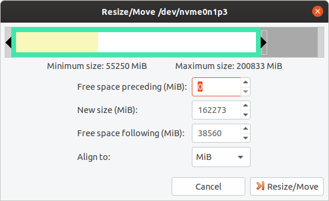
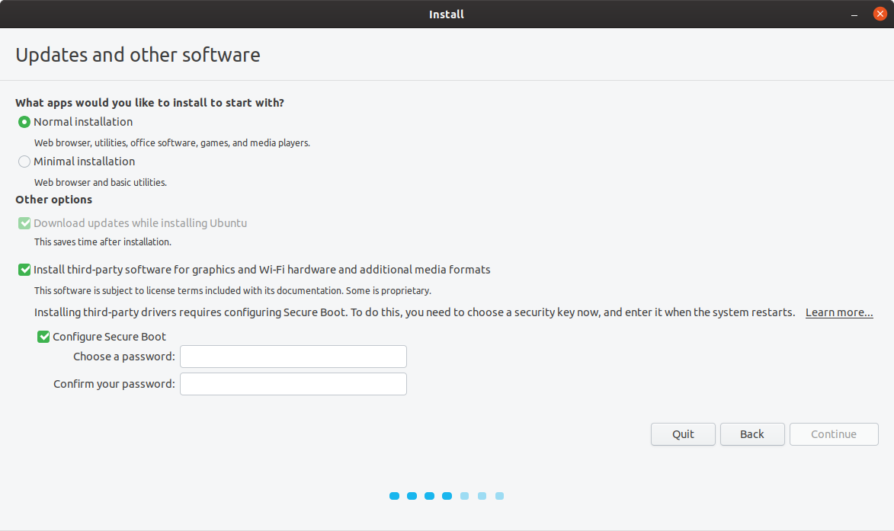
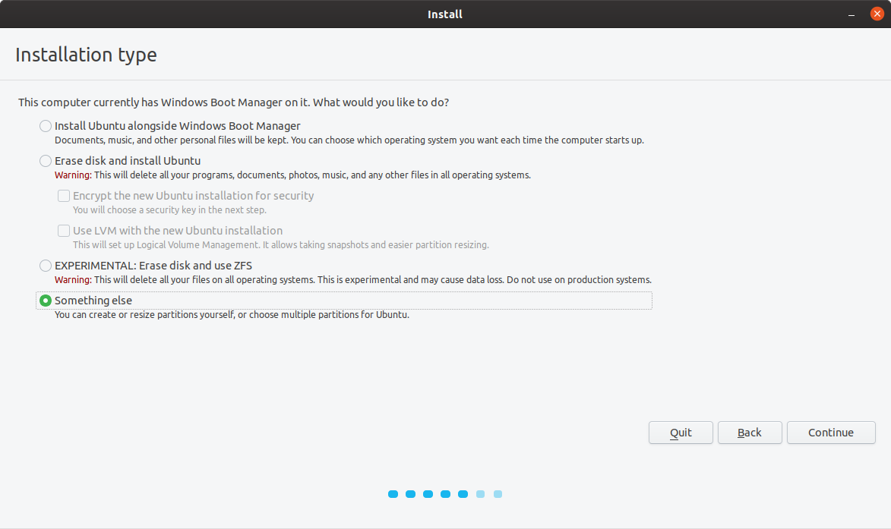
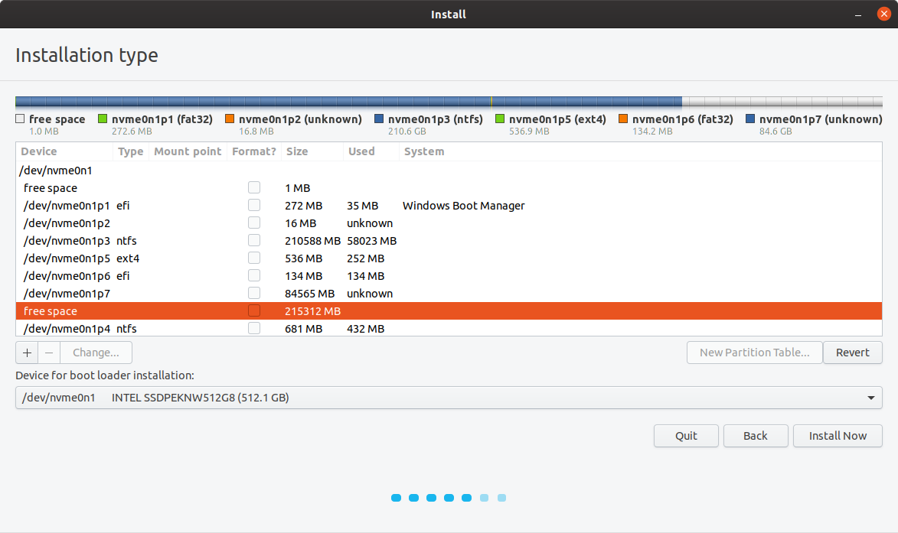
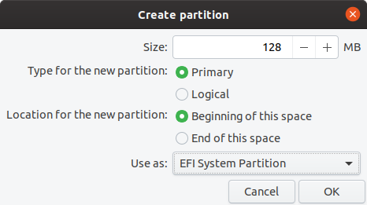
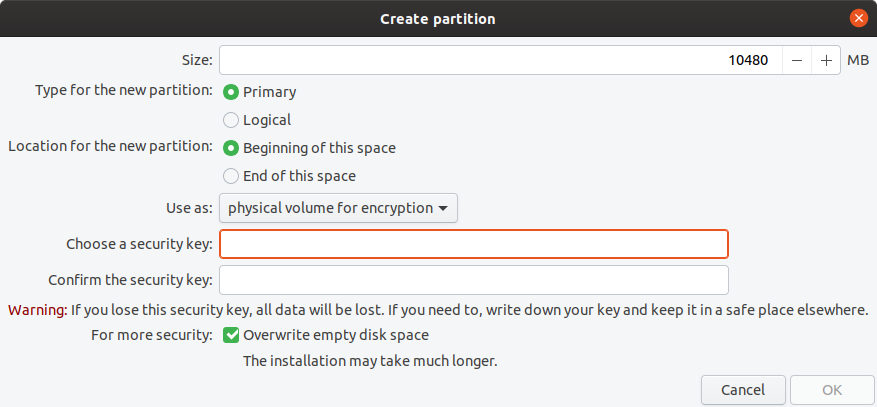
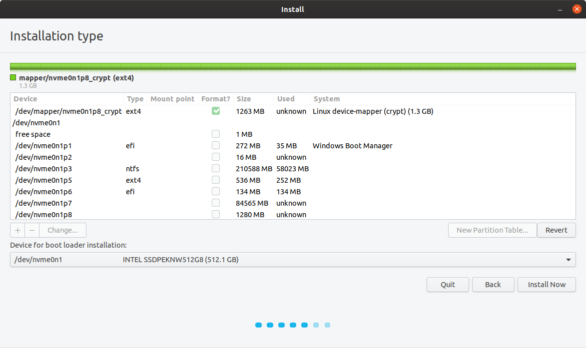
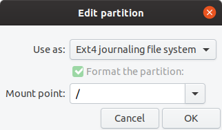

## Dual boot disk encryptie

Dit document beschrijft hoe ubuntu met encryptie te installeren is als dualboot systeem naast een bestaand besturingssysteem. 
Tijdens ubuntu installatie procedure wordt gevraagd of het installatie programma encryptie moet gebruiken op de gehele disk met als waarschuwing dat alle bestaande systemen dan gewist worden.
Om dat te vermijden zijn de programma's gparted en de partitie tool van het installatie programma te gebruiken.

De stappen in het kort:

* Zet een ubuntu versie op een usbstick
* Boot de usb en kies try ubuntu before installing
* Start gparted en maak genoeg ruimte vrij door de grootste partitie te vekleinen
* Start het installatie programma en kies de optie om handmatig de partities te configureren
* maak een EFI (128MB), /boot (1G), en / (gewenste grootte) encrypted root partitie.
* Installeer ubuntu

## Usb stick ubuntu

Controleer de disk letter (sda) nadat je de usb ingevoerd hebt:

    $dmesg | grep sd
    ..
    sd 5:0:0:0: [sda] Attached SCSI removable disk
    ..

Installeer iso met de latest versie van ubuntu op een usb stick met dd:

    $dd if=ubuntu_19.10.iso of=/dev/sda 

## Boot de usb

Start je computer op vanaf de usb stick. Het BIOS van de computer configureren om vanaf de usb stick op te starten kan nodig zijn. Zoek in dat geval hoe je in het bios komt. Vaak is het indrukken van een van de functie toetsen F2,F10/11/12 of de delete toets tijdens het opstarten nodig. 
In het bios is er een menuoptie boot volgorde en de usb stick moet daarin te zien zijn als usb:uefi of iets dergelijks.
Selecteer die optie en sla het op in het BIOS.  
Kies try ubuntu without installing zodra de eerste installatie opties verschijnen.
Het systeem werkt dan vanuit het RAM geheugen zonder iets te installeren op de harde schijf. 

## Maak ruimte vrij 

Gparted is handig om eenvoudig diskruimte van het bestaande besturingssysteem te verkleinen. In de vrijgekomen ruimte kunnen dan nieuwe partities gemaakt worden.
Verklein de partitie van een bestaand systeem met de meeste ruimte tot een redelijke grootte.

    $sudo su gparted

## Start het installatie programmma

De gangbare opties voor een installatie zijn hier te kiezen en voor de third party software is secure boot nodig. 

"Something else" is de menu keuze waarmee de partities handmatig aan te maken zijn.

Selecteer in het volgende scherm de vrij beschikbare ruimte.

Het plusje wordt beschikbaar bij het selecteren van de vrije ruimte. Druk op het plusje om een EFI partitie te maken.
In de EFI partitie wordt het bestand geinstalleerd waarmee, nadat het BIOS dit bestand in het geheugen geladen heeft, de linux kernel geladen wordt. Voor ubuntu is dat bootx64.efi. 

De boot partitie is nodig om daarin de bestanden voor het eerste opstart menu "grub" te installeren, de kernel "vmlinuz" en de opstart RAM disk "initrd" bestanden. Hoe meer updates er geinstalleerd worden van de kernel en de initrd bestanden des te meer ruimte is er nodig. 512MB is redelijk. 

Het root bestandssysteem / is in een partitie te installeren. Swap, /var/log, /home of een aparte partitie voor applicaties is soms nodig.
De hele partitie wordt in dit geval gebruikt voor de totale ubuntu installatie. Met de optie "physical volume for encryption" is de partitie met een passphrase volledig te encrypten.

WAARSCHUWING: wees voorzichtig met de passphrase. 
De character encoding zoals bijvoorbeeld UTF-8 kan van invloed zijn op de passphrase en het zou kunnen dat een disk overgezet in een ander systeem met een iets andere encoding niet te openen is. 

Er verschijnt een crypted linux device mapping waarop het / root bestandsysteem geconfigureerd moet worden. 

De knop "install" wordt actief zodra de minimaal benodigde partities aangemaakt zijn. 
Start de installatie door "install" te kiezen.
