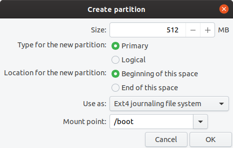

# Read the docs theme 

# Mkdocs

Het mkdocs pakket is een handig pakket om standaard software documentatie mee te schrijven.

# Mkdocs installeren
    
    (apt/yum install (python-)pip3)
    pip3 install mkdocs

# Mkdocs nieuw project maken

    mkdocs new "projectnaam"

# Wijzigingen aan mkdocs project tekst live bekijken 

    (in de project directory)
    [matthewbuchananastley@fedora linuxhowto.git]$ ls
    docs  mkdocs.yml  README.md
    [matthewbuchananastley@fedora linuxhowto.git]$ mkdocs serve 
    INFO     -  Building documentation...
    INFO     -  Cleaning site directory
    INFO     -  The following pages exist in the docs directory, but are not included in the "nav" configuration:
              - index.md
              - rpm.md
    INFO     -  Documentation built in 0.14 seconds
    INFO     -  [11:40:24] Watching paths for changes: 'docs', 'mkdocs.yml'
    INFO     -  [11:40:24] Serving on http://127.0.0.1:8000/
    INFO     -  [11:40:26] Browser connected: http://127.0.0.1:8000/


De url http://127.0.0.1:8000/ is dan in de browser te openen

# Teksten toevoegen

Teksten gaan in de docs directory, bestanden hebben de .md extensie.

# Plaatjes toevoegen.

Plaatjes kunnen in een directory in de docs directory.
Op de volgende manier kunnen plaatjes ingevoegd worden op een pagina:

    

# code blocks laten wrappen

Wanneer codeblocks die je specificeert met ``` boven en onder de code, het tekstblok weergeeft op een lange regel dan kan dat met een wrap instructie in de css te maken hebben, zo is dit te verhelpen: 

/usr/lib/python3/dist-packages/mkdocs/themes/readthedocs/css/theme.css

het volgende stukje css van nowrap naar wrap veranderen:

    code,.rst-content tt,.rst-content code{white-space:wrap


# Readthedocs.org

Wanneer de mkdocs documentatie in de lokale mkdocs directory geschreven is dan kan dat gepusht worden naar de github repository docs directory. 

Met een gratis readthedocs.org account en nadat er een koppeling is gemaakt tussen readthedocs en github.com is er automatisch een readthedocs documentatie pagina the genereren. Na elke wijziging aan de docs van een in readthedocs.org geconfigureerd project zal er voor dat project automatisch nieuwe documentatie gegenereerd worden.

Er is daarvoor in de docs root directory van een project een .readthedocs.yaml bestand nodig. Afhankelijk van de mkdocs versie en vereisten daarvoor kunnen er in de yaml file en pip3 requirements.txt benodigde software versies gespecificeerd worden.

