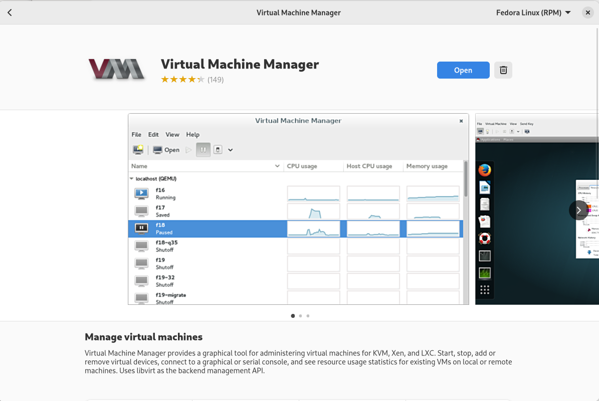
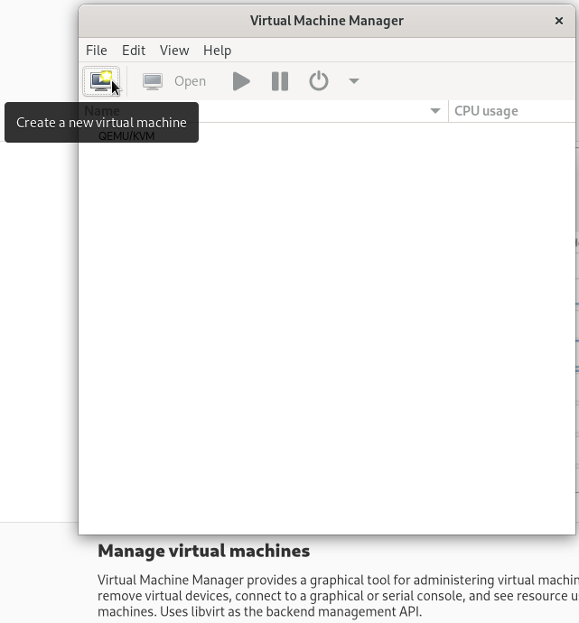
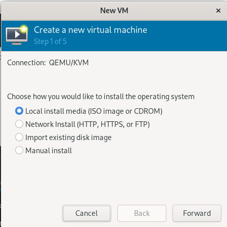
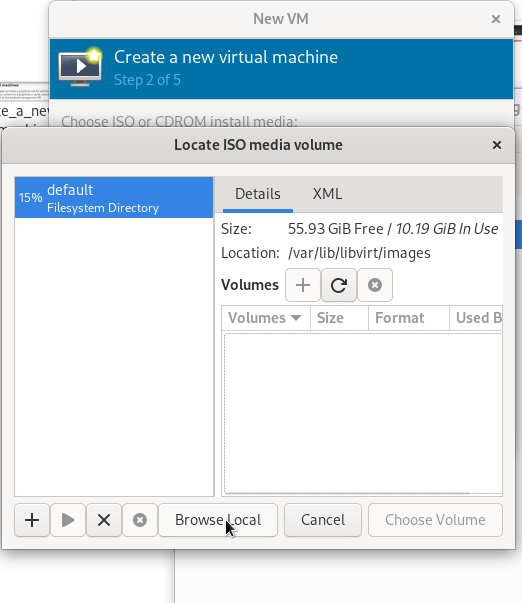
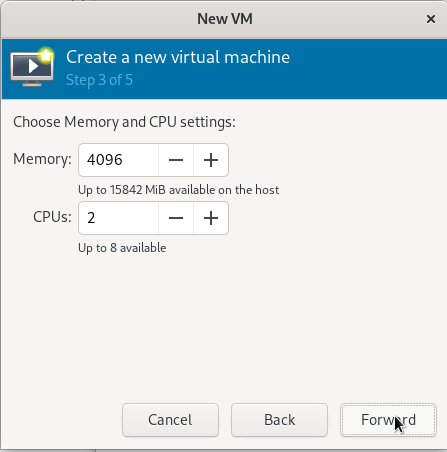
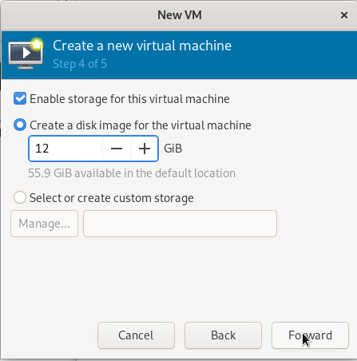
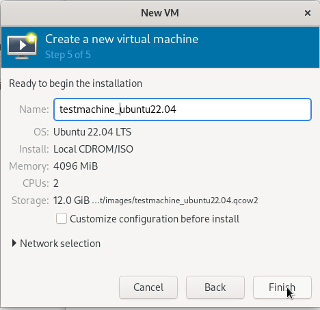

# KVM virtualisation

Virtualisatie gebeurt op Fedora met behulp van de volgende pakketten:

    [root@fedora vop]# yum install libvirt-daemon-kvm qemu-kvm qemu-kvm-core

Virt-manager wordt gebruikt om de virtuele systemen te installeren en beheren. Het is te installeren via het grafische software installatie programma dat in Fedora aangegeven wordt door het volgende icoontje:

En in het software installatie programma ziet dat er zo uit:

# Een nieuwe virtuele machine configureren

Selecteer de iso van de te installeren linux distributie. 

Selecteer het aantal processor cores en de hoeveelheid geheugen:

Selecteer de hoeveelheid schrijfruimte:

Geef een naam op van de virtuele machine:

